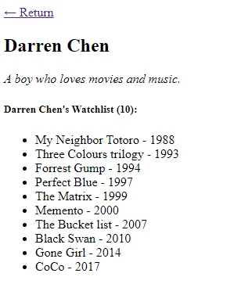

## Template: 渲染模板

### Jinja2 模板引擎
詳細說明請參考 [Jinja Documentation](https://jinja.palletsprojects.com/)

---

### 範例模板: watchlist.html
列出 user 喜歡的 movie 清單 (包含片名及年份)
```text
<!DOCTYPE html>
<html lang="en">
<head>
    <meta charset="utf-8">
    <title>{{ user.username }}'s Watchlist</title>
</head>
<body>
<a href="{{ url_for('index') }}">&larr; Return</a>
<h2>{{ user.username }}</h2>

    <i>{{ user.bio }}</i>

    <i>This user has not provided a bio.</i>

{# Below is the movie list (this is comment) #}
<h5>{{ user.username }}'s Watchlist ({{ movies|length }}):</h5>
<ul>
    
    <li>{{ movie.name }} - {{ movie.year }}</li>
    
</ul>
</body>
</html>
```

### 主程式負責使用資料渲染模板
將用戶及喜好片單資料 (user/movies)，透過 render_template 方法渲染模板。  
特別注意模板文件必須放置在相對主程式的 templates/ 子目錄中
```python
from flask import Flask, render_template
import os

app = Flask(__name__)
app.secret_key = os.getenv('SECRET_KEY', os.urandom(12))
app.jinja_env.trim_blocks = True
app.jinja_env.lstrip_blocks = True

user = {
    'username': 'Darren Chen',
    'bio': 'A boy who loves movies and music.'
}

movies = [
    {'name': 'My Neighbor Totoro', 'year': '1988'},
    {'name': 'Three Colours trilogy', 'year': '1993'},
    {'name': 'Forrest Gump', 'year': '1994'},
    {'name': 'Perfect Blue', 'year': '1997'},
    {'name': 'The Matrix', 'year': '1999'},
    {'name': 'Memento', 'year': '2000'},
    {'name': 'The Bucket list', 'year': '2007'},
    {'name': 'Black Swan', 'year': '2010'},
    {'name': 'Gone Girl', 'year': '2014'},
    {'name': 'CoCo', 'year': '2017'}
]


@app.route('/watchlist')
def watchlist():
    return render_template('watchlist.html', user=user, movies=movies)
```

### 網頁呈現結果

 
---

### 基底模板: base.html
我們可將常用的樣式定義為基底模板，讓未來的新模版可直接繼承，有需要再進行局部客製化變更。  
基底模版內的各個分區用 block 和 endblock 標籤聲明範圍

<!--  -->
```text
<!DOCTYPE html>
<html>
<head>
    
        <meta charset="utf-8">
        <title>Template - HelloFlask</title>
        
    
</head>
<body>
<main>
    
    <h1>base.html's Content</h1>
    
</main>
<footer>
    
</footer>

</body>
</html>
```
<!--  -->

### 子模板: child.html
第一行使用 extends 指定要繼承的基底模板  
接著宣告要異動的部分，如本例是要覆寫基底模板的 block content 分區內容。  
>> ~~原內容: base.html's Content~~   
>> 新內容: child.html's Content   

<!--  -->
```text



<h1>child.html's Content</h1>


```
<!--  -->

<br/><br/><br/>

[回到Flask文章列表](index.md)

<br/>
